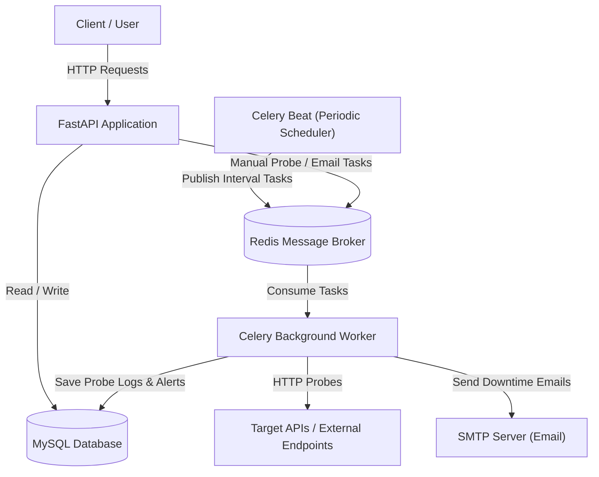
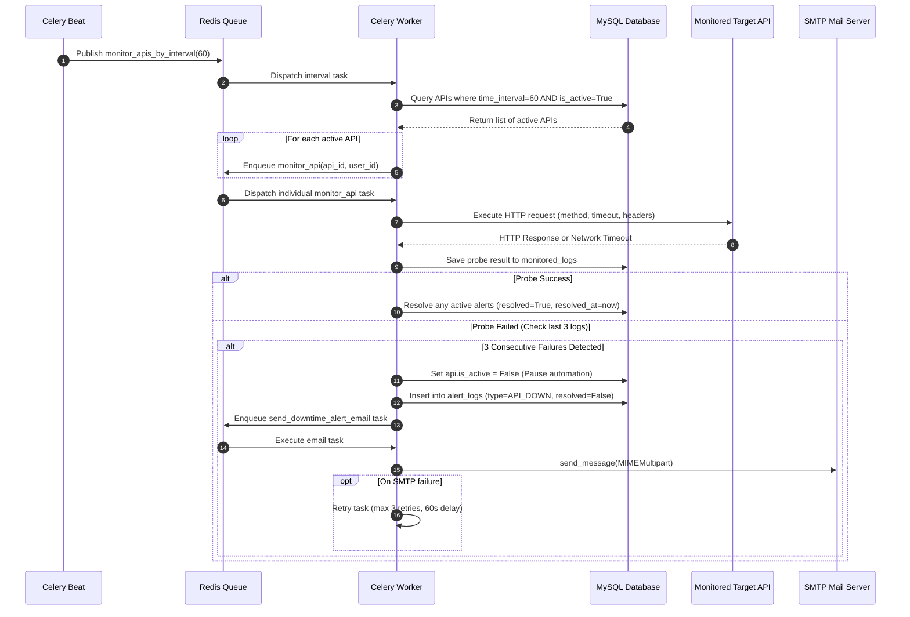
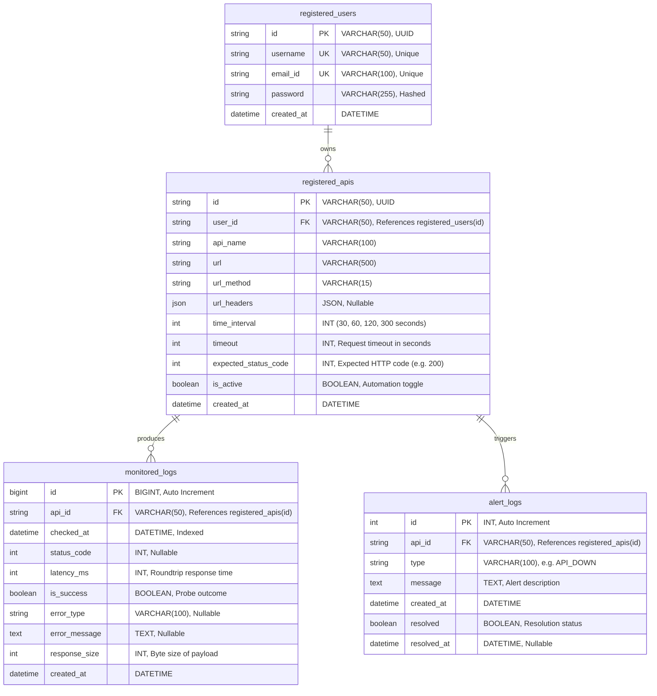

# APIPulse - API Health Monitoring and Performance Analytics System

Holla Amigos!!
APIPulse is an automated API health monitoring and performance analytics platform built with FastAPI, MySQL, Celery, and Redis. It continuously checks the uptime, latency, and status codes of registered endpoints, generates performance metrics (percentiles, uptime percentage, status code distributions), detects service outages, and dispatches email alerts asynchronously.

---

## 1. System Architecture

The system consists of five primary components:

1. **FastAPI Web Server**: Handles user authentication, API registration and configuration, manual health checks, and analytics queries.
2. **MySQL Database**: Stores persistent data including registered users, monitored APIs, historical probe logs, and alert logs.
3. **Redis Broker and Result Backend**: Operates as an in-memory message queue that holds tasks waiting to be processed by background workers.
4. **Celery Beat**: A periodic scheduler that triggers monitoring routines at predefined intervals (30s, 60s, 120s, 300s).
5. **Celery Workers**: Background execution processes that pull monitoring tasks from Redis, execute HTTP probes, record logs in MySQL, evaluate downtime conditions, and send email alerts through SMTP.

### System Architecture Diagram



---

## 2. Automation System and Workflow

The core functionality of APIPulse is its automated background monitoring engine. Instead of requiring users to manually test their endpoints, APIPulse automates the entire lifecycle of testing, recording, downtime detection, and notification.

### How Automation Works

1. **Interval-Based Scheduling**:
   - Celery Beat maintains recurring schedules for four supported monitoring frequencies: 30 seconds, 60 seconds, 120 seconds, and 300 seconds.
   - At each tick of an interval (for example, every 60 seconds), Celery Beat publishes a master task `monitor_apis_by_interval(interval=60)` into Redis.

2. **Dynamic Querying of Active Endpoints**:
   - A Celery worker picks up the interval task.
   - It queries the MySQL database for APIs where `time_interval == interval` and `is_active == True`.
   - APIs marked as inactive (`is_active = False`) are excluded automatically, which prevents wasted requests against endpoints known to be offline or paused.

3. **Parallel Task Dispatching**:
   - For every matching active API, the worker spawns an independent sub-task: `monitor_api.delay(api_id, user_id)`.
   - This fan-out approach ensures that one slow or unresponsive target API does not block or delay checks for other endpoints.

4. **HTTP Probing and Metric Recording**:
   - The worker executes an HTTP request to the target URL using the configured HTTP method (GET, POST, etc.), headers, and timeout.
   - High-precision timers measure the roundtrip response latency in milliseconds.
   - The probe result is compared against the endpoint's `expected_status_code`.
   - A new record is inserted into `monitored_logs` containing `status_code`, `latency_ms`, `is_success`, `response_size`, and timestamp.

5. **Downtime Detection and Automatic Shutoff**:
   - Immediately after saving the log, the system checks the last 3 probe logs for that API.
   - **Downtime Condition**: If all 3 most recent checks resulted in failure (`is_success == False`), the API is marked as **DOWN**.
   - **Protection Mechanism**: To prevent continuous error spam and unnecessary network strain, the system automatically sets `api.is_active = False` in the database. This removes the API from upcoming Celery Beat cycles.
   - **Alert Logging**: An unresolved alert record is created in `alert_logs` with type `API_DOWN` (with deduplication to prevent duplicate alerts).
   - **Email Notification**: An asynchronous task `send_downtime_alert_email.delay(...)` is queued to Redis.

6. **Email Delivery with Celery Retries**:
   - A Celery worker processes the email delivery task using `smtplib`.
   - The email contains both structured plain text and responsive HTML detailing the failed endpoint URL, the detected error, and the downtime timestamp.
   - The task uses `server.send_message(...)` with `MIMEMultipart`.
   - If an SMTP network error or connection failure occurs, the task catches `smtplib.SMTPException` and triggers a Celery retry with exponential backoff (up to 3 attempts, 60-second delay).

7. **Auto-Recovery**:
   - When a user fixes their service and toggles the API back on, subsequent successful probes (`is_success == True`) automatically locate any open alerts for that API, mark `resolved = True`, and record the `resolved_at` timestamp.

### Automation Workflow Sequence Diagram



---

## 3. Database Entity-Relationship (ER) Diagram

The APIPulse database schema consists of four relational tables with foreign key constraints, unique constraints, and composite indexes designed for time-series analytics and fast lookups.



### Key Database Indexes
- `ix_monitored_logs_api_id_checked_at`: Composite index on `(api_id, checked_at)` for high-speed time-series analytics and trend generation.
- `ix_alert_logs_api_id_resolved`: Composite index on `(api_id, resolved)` for instantaneous active alert checks and deduplication.
- `unique_url_url_method`: Unique constraint on `(url, url_method)` to prevent duplicate API registrations.

---

## 4. Performance Analytics Engine

APIPulse aggregates raw probe data to deliver performance insights:

- **Uptime Percentage**: Calculated as `(successful_checks / total_checks) * 100`.
- **Latency Percentiles**:
  - **P50 (Median)**: The response time below which 50% of requests fall.
  - **P95**: Response time experienced by 95% of requests (identifies tail latency).
  - **P99**: Extreme worst-case latency under load (identifies edge anomalies).
- **Latency Extremes**: Minimum, maximum, and average response times.
- **Status Code Distribution**: Grouped counts of returned HTTP codes (e.g., 200, 404, 500, 503).
- **Health Classification**:
  - `HEALTHY`: Uptime >= 98% and P95 latency <= 1000ms.
  - `DEGRADED`: Uptime between 90% and 98%, or P95 latency > 1000ms.
  - `DOWN`: Uptime < 90% or currently subject to an unresolved downtime alert.

---

## 5. API Endpoints Reference

### Authentication (`/auth`)
| Method | Endpoint | Description |
| :--- | :--- | :--- |
| POST | `/auth/register` | Register a new user account |
| POST | `/auth/login` | Authenticate and obtain JWT bearer token |

### API Management (`/api`)
| Method | Endpoint | Description |
| :--- | :--- | :--- |
| POST | `/api/register` | Register an endpoint for monitoring |
| GET | `/api/all` | List all registered APIs for the authenticated user |
| GET | `/api/{id}` | Get detailed configuration of an API |
| PUT | `/api/update/{id}` | Update API configuration (URL, headers, interval, etc.) |
| DELETE | `/api/delete/{id}` | Delete an API and its associated logs and alerts |
| PATCH | `/api/toggle-active/{id}` | Toggle automation on or off (`is_active = true/false`) |

### Monitoring & Probing (`/monitor`)
| Method | Endpoint | Description |
| :--- | :--- | :--- |
| POST | `/monitor/{api_id}` | Manually execute an immediate health check |
| GET | `/monitor/logs/{api_id}` | Retrieve historical probe logs for an API |
| GET | `/monitor/recent-log/{api_id}` | Retrieve the single most recent log for an API |

### Performance Analytics (`/analytics`)
| Method | Endpoint | Description |
| :--- | :--- | :--- |
| GET | `/analytics/api/{id}/metrics` | Aggregated metrics (Uptime %, Latency P50/P95/P99, Health status) |
| GET | `/analytics/api/{id}/trends` | Historical trend buckets (1h, 6h, 24h, 7d intervals) |
| GET | `/analytics/dashboard/summary` | Global summary (total APIs, active count, total checks, total alerts) |

---

## 6. How to Run the Project

### Prerequisites
- Python 3.11+
- MySQL Server running on port 3306
- Redis Server running on port 6379

### 1. Environment Configuration
Create a `.env` file in the project root:
```env
DB_HOST=localhost
DB_PORT=3306
DB_USER=root
DB_PASSWORD=your_mysql_password
DB_NAME=api_monitoring

JWT_SECRET_KEY=your_jwt_secret_key
JWT_ALGORITHM=HS256
ACCESS_TOKEN_EXPIRE_MINUTES=1440

SMTP_HOST=smtp.gmail.com
SMTP_PORT=587
SMTP_USER=your_email@gmail.com
SMTP_PASSWORD=your_app_password
EMAILS_FROM=alerts@apipulse.com
```

### 2. Install Dependencies
```bash
pip install -r requirements.txt
```

### 3. Run Database Migrations
```bash
alembic upgrade head
```

### 4. Start Services

Open four separate terminal windows:

**Terminal 1: Redis Server**
```bash
redis-server
```

**Terminal 2: FastAPI Application**
```bash
uvicorn app.main:app --reload --port 8000
```
Interactive documentation will be available at `http://127.0.0.1:8000/docs`.

**Terminal 3: Celery Worker**
```bash
celery -A app.dependencies.celery_dependency worker --loglevel=info -P solo
```
*(Use `-P solo` on Windows to handle concurrent task execution without OS fork limitations).*

**Terminal 4: Celery Beat (Periodic Scheduler)**
```bash
celery -A app.dependencies.celery_dependency beat --loglevel=info
```


Agradezco su valioso tiempo dedicado a revisar mi proyecto

Mucha Graciasss....
Adios.......

~ApexLevo